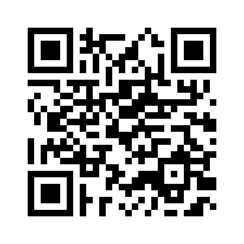
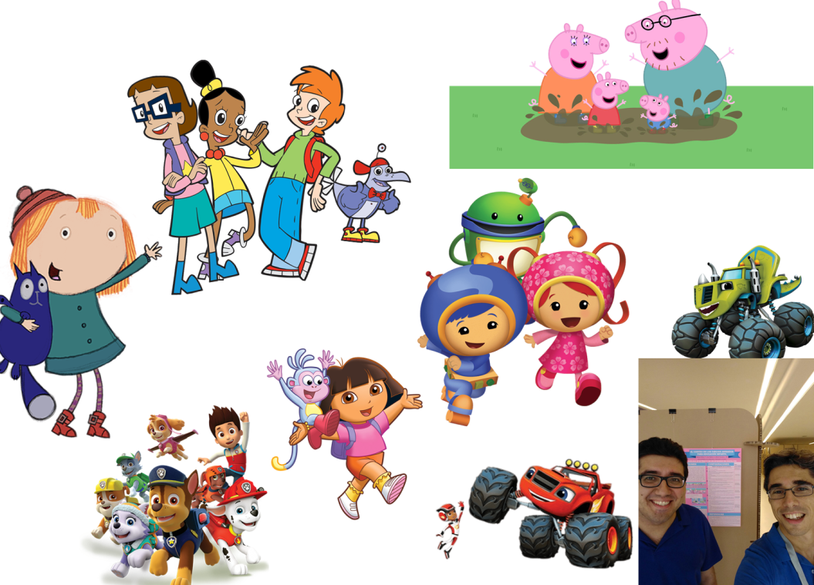
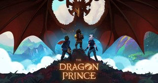
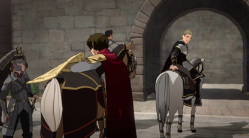
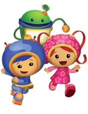
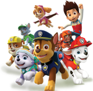
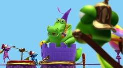
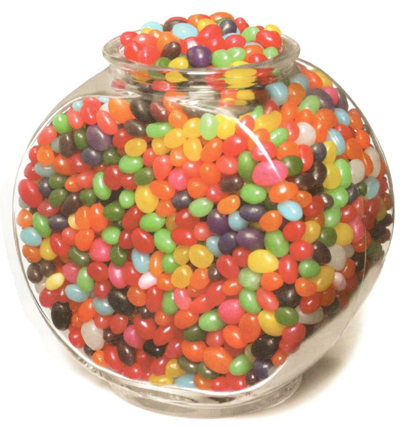

# Acceso a la presentación {data-background-image="assets/images/peppa1.jpg" data-background-opacity="0.25"}

## {data-background-image="assets/images/peppa1.jpg" data-background-opacity="0.18"}

{width=60%}

[https://pbeltran.github.io/pijama-jaem/](https://pbeltran.github.io/pijama-jaem/)

# ¿Cómo empieza todo esto? {data-background-image="assets/images/peppa1.jpg" data-background-opacity="0.18"}

## Con una historia

{width=80%}
 
 
# Cómo no usar las pelis y las series en el aula {data-background-image="assets/images/peppa1.jpg" data-background-opacity="0.25"}
 
##

>Hobbs (2006) enumera formas no adecuadas de utilización en el aula:

:::incremental

1. No tener un objetivo instruccional bien definido.
2. No utilizar la pausa, el rebobinado y no volver a visionar el material.
3. Que el docente se tome las proyecciones como tiempo de descanso o para preparar otras cosas.
4. Que el docente desconecte mentalmente en las proyecciones.
::: 

##

:::incremental
5. El docente utiliza las proyecciones como una recompensa para su alumnado.
6. El docente emplea este recurso únicamente para captar la atención del alumnado. 
7. El docente utiliza el vídeo como una forma de regular el comportamiento del alumnado.
:::

# Cómo se pueden usar las pelis y las series en el aula {data-background-image="assets/images/peppa1.jpg" data-background-opacity="0.25"}

## Los gazapos {data-background-image="assets/images/liebredurero.jpg" data-background-opacity="0.25"}

:::::::::::::: {.columns}

::: {.column width="55%"}

{width=100%}
{width=100%}

:::

::: {.column width="45%"}

Una actividad directa es la de detectar un error (Sorando, 2007):

- Gazapos de contexto.
- Gazapos de concepto, de cálculo y de razonamiento.

:::
::::::::::::::

## Más actividades

:::incremental

- Resolver una situación que aparece, explícita o implícitamente en el fragmento.
- Mostrar simplemente el campo de aplicación, no se trata de resolver un problema.
- Como introducción de un tema o revisión del mismo. #mathtalks
- Dramatización.

:::

# Líneas de investigación {data-background-image="assets/images/peppa1.jpg" data-background-opacity="0.25"}

## Trabajos Fin de Grado

:::::::::::::: {.columns}

::: {.column width="35%"}

{width=45%} {width=45%}

{width=80%} 
{width=80%} 

:::

::: {.column width="60%"}

- Alicia Modrego (Educación Infantil): La patrulla canina, Equipo Umizoomi.
- Alejandro Abril (Educación Primaria): La casa de Mickey Mouse (geometría)
- Raquel Vela (Educación Infantil): Peppa Pig, Pocoyó, Las aventuras de Coco Drula.
- Ana Galindo (Educación Infantil) 

:::
::::::::::::::

## Artículos y congresos

- Sección _Matemáticas animadas_ en [EDMA0-6](http://www.edma0-6.es/index.php/edma0-6).

- Beltrán-Pellicer, P., Arnal-Bailera, A., & Muñoz-Escolano, J. M. (2018). Análisis del conteo como contenido matemático en un episodio de dibujos animados para educación infantil. _Unión, 52_, 236-249. [Enlace](http://asenmacformacion.com/ojs/index.php/union/article/view/276/pdf)

- Beltrán-Pellicer, P., Arnal-Bailera, A., & Muñoz-Escolano, J. M. (2017). Análisis ontosemiótico de un episodio de dibujos animados con contenido matemático. En _CIVEOS 2_. [Enlace](http://enfoqueontosemiotico.ugr.es/civeos/beltran.pdf)

# ¿Qué matemáticas hay aquí? {data-background-image="assets/images/peppa1.jpg" data-background-opacity="0.25"}

##

# ¿Nos ponemos gafas matemáticas? {data-background-image="assets/images/bigbang.gif" data-background-opacity="0.75"}

## 

Situaciones
Aplicaciones extra-matemáticas, tareas, ejercicios, etc.
Lenguajes (en sentido amplio)
Términos, expresiones, notaciones, gráficos, etc.
Diversos registros (escrito, oral, gestual, etc.) y representaciones.
Propiedades y otros enunciados
Conceptos-definición, propiedades y proposiciones.
Conceptos introducidos mediante definiciones, propiedades o proposiciones de estos conceptos.
Procedimientos
Algoritmos, operaciones, técnicas de cálculo, etc.
Argumentos
Usados para validar o explicar las proposiciones y procedimientos, deductivos o de otro tipo.

##

# Conclusiones

## 

- Concienciarnos acerca de la existencia de recursos que no vienen en libros de texto y que están accesibles en la casa de nuestros alumnos: los dibujos animados, muchos de ellos producidos con una intencionalidad educativa.
- No promovemos que se vea más TV. Asumimos que se ve.

##

- Muchas maneras de llevarlo al aula: 
	- Gazapos, detener un episodio, resolver problemas, como introducción ofreciendo un contexto, dramatización, etc.
- Necesidad de tener herramientas para analizar el recurso y diseñar las secuencias didácticas.
- Aquí hemos usado los dibujos, pero el proceso seguido sirve para cualquier otro recurso (juegos, manipulables, libros de texto).
- Futuras vías de colaboración o investigación.

# Para terminar: ¿nos ponemos a prueba {data-background-image="assets/images/caramelos.png" data-background-opacity="0.25"}

##

{width=65%}

# Créditos y referencias

## Lista de referencias

Sección _Matemáticas animadas_ en [EDMA0-6](http://www.edma0-6.es/index.php/edma0-6).

Beltrán-Pellicer, P., Arnal-Bailera, A., & Muñoz-Escolano, J. M. (2018). Análisis del conteo como contenido matemático en un episodio de dibujos animados para educación infantil. _Unión, 52_, 236-249. [Enlace](http://asenmacformacion.com/ojs/index.php/union/article/view/276/pdf)

Beltrán-Pellicer, P., Arnal-Bailera, A., & Muñoz-Escolano, J. M. (2017). Análisis ontosemiótico de un episodio de dibujos animados con contenido matemático. En _CIVEOS 2_. [Enlace](http://enfoqueontosemiotico.ugr.es/civeos/beltran.pdf)

## Créditos

_Compartir el conocimiento de forma libre es una buena práctica._

En estas diapositivas se han utilizado materiales disponibles en abierto y se han citado las fuentes correspondientes. El contenido de la presentación está publicado con licencia Creative Common [CC-BY-SA-4.0](https://creativecommons.org/licenses/by-sa/4.0/legalcode.es), lo que quiere decir que puedes compartirla y adaptarla, citándonos (Pablo Beltrán-Pellicer y José Mª Muñoz-Escolano) y poniendo un enlace a [https://pbeltran.github.io/elemprob1](https://pbeltran.github.io/elemprob1).

_Siéntete libre de trabajar con este material y de contactar conmigo para compartir tus reflexiones._

##

Presentación realizada con  <a href="https://revealjs.com/#/">Reveal.js</a>, <a href="https://pandoc.org/">Pandoc</a>, <a href="https://www.mathjax.org/">MathJax</a> y <a href="https://www.markdownguide.org/">Markdown</a>. El código fuente está disponible en [https://github.com/pbeltran/pijama-jaem](https://github.com/pbeltran/pijama-jaem)

Las imágenes son propias y de dominio público, salvo las que se ha citado la fuente en su diapositiva y las obtenidas en [https://www.freepik.es](www.Freepik.es): 

